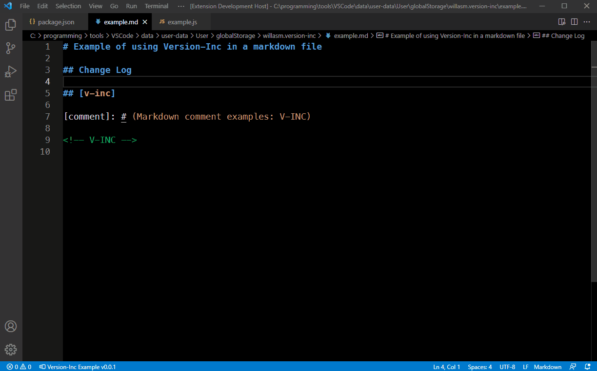
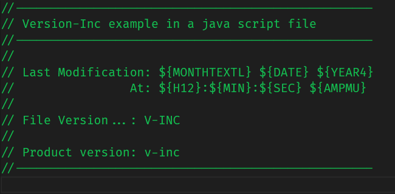
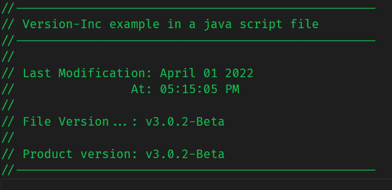

# Version Inc
Increases the version in projects package.json file.
Inserts version string and macros into other project files.

## Features
- Increase the version in projects package.json file.
- Optionally, insert new version string into other project files.
- Insert date and/or time macros into other project files.
- Current version is displayed on the status bar.
- Update version by clicking status bar button.

## Screenshot


## Settings

`"version-inc.statusBarPrompt"` - Status Bar button when clicked with the mouse will prompt for Version Increment or Decrement when this is enabled. Default is 'disabled' and when the button is clicked version increment will occur.

`"version-inc.useDisplayName"` - Status Bar button text will display the displayName: "value" from package.json when this setting is enabled. Displays the name: "value" when this is disabled.

## Usage
The following commands are available from the command pallette: (Windows: CTRL+Shift+P or F1) (Mac: CMD+Shift+P)
- `Version Inc: Increment Package.json Version` (Increment Project Version)
- `Version Inc: Decrement Package.json Version` (Decrement Project Version)
- `Version Inc: Edit Settings for Update Files` (Edit Project Files to Update List)
- `Version Inc: Edit Example Files` (Edit version-inc Example Files)

Or simply click on the status bar item to increment the current version.

## Configure Project Files to Update
The string `"V-INC"` (case insensitive) can be inserted into any project file and this will be replaced with the new versions string. The files list is maintained in the `version-inc-{ProjectName}.json` file stored in this extensions Global Storage folder. This settings file can be edited with the command `Version Inc: Edit Settings for Update Files`. By default it contains 2 example files, `example.md` and `example.js` (also stored in the Global Storage folder).

The settings file also has json schema validation which simplifies adding new file entries.

Here is the default settings...

```
[
	{
		"Filename": "example.md",
		"FileLocation": "${globalStorage}",
		"Enable": false,
		"RetainLine": true,
		"InsertBefore": "",
		"InsertAfter": ""
		"TrimTextStart": 5,
		"TrimTextEnd": 38
	},
	{
		"Filename": "example.js",
		"FileLocation": "${globalStorage}",
		"Enable": false,
		"RetainLine": false,
		"InsertBefore": "v",
		"InsertAfter": "-Beta"
		"TrimTextStart": 0,
		"TrimTextEnd": 0
	}
]
```
The `"Filename":` entry contains the file name to update.

The `"FileLocation":` entry is the path to the file to update. This can be set to `${workspaceFolder}` or simply `""` to set location to the projects root folder. To set location to a sub-folder within the projects root folder enter `"subfoldername"` or `subfoldername\\secondlevelfolder` without a trailing `\\`. The name `"${globalStorage}"` used for the example files simply points to this extensions Global Storage location where the example files are strored.

`"Enable":` Enable (`true`) or disable (`false`) for updating of this file.

`"RetainLine"` Enable (`true`) or disable (`false`) to retain the line with the V-INC macro.

`"InsertBefore":` String to insert before the new version string.

`"InsertAfter":` String to insert after the new version string.

`"TrimTextStart":` Number of characters to trim from the start of the line with the v-inc macro.

`"TrimTextEnd":` Number of characters to trim from the end of the line with the v-inc macro.


To see this extension in operation, open the example files with the command `Version Inc: Edit Example Files`, then enable the example files (Set Enable to true), then run the increment version command to see the results. Note that this will increment the version in your package.json file but you can use the command `Version Inc: Decrement Package.json Version` to restore it after you have examined the example files.

Note: The `RetainLine`, `"TrimTextStart"` and `"TrimTextStart"` options were added in v0-0-6 so if you have modified the settings file from a previous version you will need to add the respective lines to any project settings file you have (see the example settings above).

Note: The updated files are not automatically saved. This allows you to review the changes made and to continue making any other changes you require. The package.json file however is save with the new version string inserted.

Here is a before and after look at one of the example files that has been updated...

## Before...


## After...



## Macros...
| Macro                 | Macro Text is Replaced Replaced With                                     |
| --------------------- | ------------------------------------------------------------------------ |
| `V-INC`               | Insert the new version string.                                          |
| `${H12}`              | Insert current time hours (two digit - 12 hour format).                 |
| `${H24}`              | Insert current time hours (two digit - 24 hour format).                 |
| `${MIN}`              | Insert current time minutes (two digit format eg. 01).                  |
| `${SEC}`              | Insert current time seconds (two digit format eg. 01).                  |
| `${AMPMU}`            | Insert AM or PM (upper case).                                           |
| `${AMPMU}`            | Insert am or pm (lower case).                                           |
| `${YEAR4}`            | Insert Year (4 digits eg. 2022).                                        |
| `${YEAR2}`            | Insert Year (2 digits eg. 22).                                          |
| `${MONTHTEXTL}`       | Insert Month full text (eg. January).                                   |
| `${MONTHTEXTS}`       | Insert Month abbreviated text (eg. Jan).                                |
| `${MONTHNUMBER}`      | Insert Month number (two digit format eg. 01 for January).              |
| `${DATE}`             | Insert the date (two digit format eg. 01 for the first of the month).   |

Note: The text of the macros is case insensitive. I plan to add more macros in the future so if there is anything you would like added please let me know at my [Github Issues Page](https://github.com/willasm/version-inc/issues).

## Release Notes
See the [Release Notes](RELEASE.md) for details.

